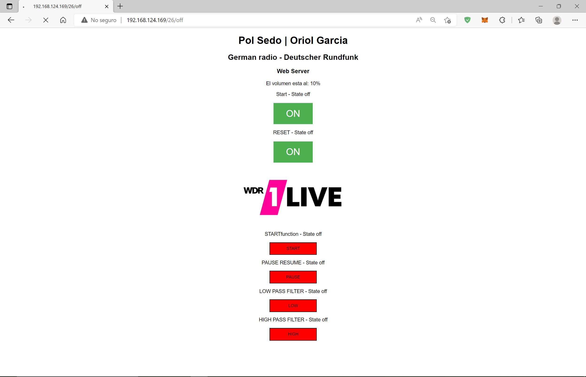
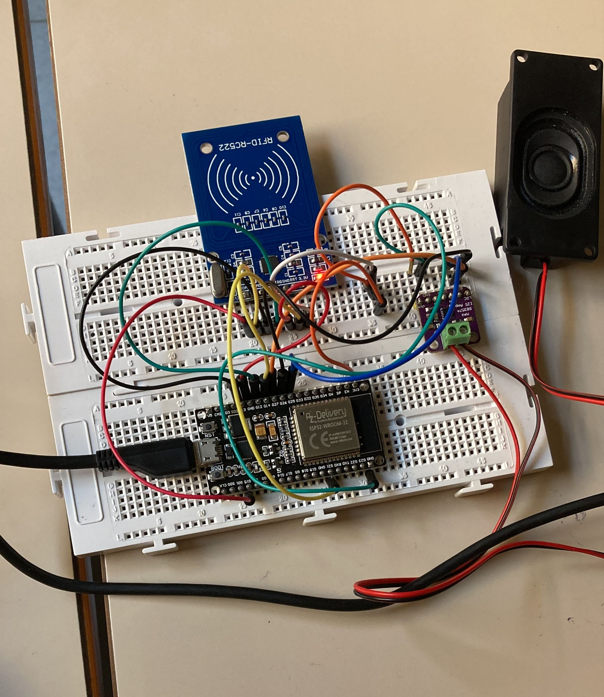

###### POL SEDÓ MOTA  | ORIOL GARCIA VILA
# PROJECTE FINAL DE PROCESSADORS DIFGITALS:

+ _CODIGO:_

Primero de todo incluimos todas las librerias necesarias:
```CPP
#include <Arduino.h>
#include <SPI.h>
#include <MFRC522.h>
#include <WiFi.h>
#include "Audio.h"
#include "SD.h"
#include "FS.h"
#include "ESPAsyncWebServer.h" 
#include "SPIFFS.h"
```
Seguimos declarando los pines que utilizaremos para las connexionnes físicas al lector NFC i al amplificador:
```cpp
#define RST_PIN           21 
#define SS_PIN            15 
#define SPI_MOSI_NFC      13
#define SPI_MISO_NFC      12
#define SPI_SCK_NFC       14
MFRC522 mfrc522(SS_PIN, RST_PIN);

#define I2S_DIN       25
#define I2S_BCLK      27
#define I2S_LRC       26
```

Ahora creamos las clases y variables necesarias para las partes de audio y wifi, como por ejemplo el nombre y contraseña del wifi al que nos vamos a connectar o las variables para sincronizar el tiempo.
```cpp
//AUDIO:
Audio audio;
int volumen=11;// variable controladora del volumen

//WIFI:
WiFiServer server(80); //webserver port 80
String header; //variable para cabezera http
unsigned long currentTime = millis();
unsigned long previousTime = 0;
const long timeoutTime = 2000;
String ssid = "Wifipol";
String password = "12345678";
```
Seguidamente creamos unas variables String que estan en 'on' o 'off' dependiendo de si una determinada función esta activada o no. Básicamente si se esta connectado al audio a reproducir, si esta pausado, filtrado o puesto a reset.
```cpp
String StartState = "off";
String LOWpassState = "off";
String HIGHpassState = "off";
String PauseState = "off";
String RESET_S="off";
```

También hemos creado una función booleana que nos devuelve si dos vectores byte son iguales o no.
```cpp
 boolean compareArray(byte array1[],byte array2[])
{
  if(array1[0] != array2[0])return(false);
  if(array1[1] != array2[1])return(false);
  if(array1[2] != array2[2])return(false);
  if(array1[3] != array2[3])return(false);
  return(true);
}
```

Declaramos 2 funciones que van a ser las que se ejecuten en 2 tascas (pinned to core).
```cpp
void loopaudio(void *parameter);
void loopnfc(void *parameter);
```

Para acabar con las declaraciones, creamos unas variables byte, 1 para guardar el codigo uid de la tarjeta leida actualmente y 4 con nuestras tarjetas que son las que van a activar unas funciones.
También necesitamos unas variables auxiliares para iterar.
```cpp
byte ActualUID[4]; //almacenará el código del Tag leído
byte tarjeta[4]= {0x20, 0xA9, 0x2F, 0x0C} ; //código de tarjeta
byte chip[4]= {0xE0, 0x97, 0xB3, 0x21} ; //código del chip
byte POL[4]= {0x86, 0x56, 0xB1, 0x9B} ; //código del POL
byte URI[4]= {0x66, 0xD6, 0x01, 0xBE} ; //código del URI

int contPR=0;   //contador Pause | Resume
int acces = 0;  //contador de acceso
int i=0; 
```

Ahora empezamos con el setup:
En este vamos a inicializar la comunicación por el puerto serie, el SPInfc con sus pines y el mfrc522. También iniciamos la connexión wifi connectandonos al wifi declararo anteriormente (ssid, password) para inicializar también el webserver, seguidamente mostramos por pantalla la IP que se nos asigna. Iniciamos el audio con los pines del amplificador y le ponemos el volumen a un valor de una variable llamada 'volumen'. Connectamos el audio a la radio alemana 'einslive'. Finalmente declaramos las tascas (pinned to core) del audio i de nfc para tener un core con el loop de audio y el otro con el lector NFC para que no se interfieran.
```cpp
void setup() {
    
    Serial.begin(115200); //Iniciamos la comunicación serial

    //NFC:
    SPInfc.begin(SPI_SCK_NFC, SPI_MISO_NFC, SPI_MOSI_NFC, SS_PIN); //Iniciamos el Bus SPI
    mfrc522.PCD_Init(); // Iniciamos el MFRC522
    Serial.println("Lector de UID connectado");
    
    delay(500);
    
    //WIFI:
    WiFi.disconnect();
    WiFi.mode(WIFI_STA);
    WiFi.begin(ssid.c_str(), password.c_str());
    while (WiFi.status() != WL_CONNECTED) delay(500);
    Serial.println("WIFI CONNECTED");
    Serial.println("IP address: ");
    Serial.println(WiFi.localIP());
    Serial.println("Server Begin");
    server.begin();

    //AUDIO:
    audio.setPinout(I2S_BCLK, I2S_LRC, I2S_DIN);
    audio.setVolume(volumen); // 0...21
    //audio.connecttohost("https://22183.live.streamtheworld.com/RAC_1.mp3"); //RAC1
    audio.connecttohost("http://www.wdr.de/wdrlive/media/einslive.m3u"); //EINSLIVE
 
      //TASK DE AUDIO
      xTaskCreatePinnedToCore(
        loopaudio,            /* Task function. */
          "loopaudio",        /* name of task. */
          15000,              /* Stack size of task */
          NULL,               /* parameter of the task */
          1,                  /* priority of the task */
          NULL,               /* Task handle to keep track of created task */
          0);

    delay(500);

      //TASK DE NFC
      xTaskCreatePinnedToCore(
        loopnfc,              /* Task function. */
          "loopnfc",          /* name of task. */
          15000,              /* Stack size of task */
          NULL,               /* parameter of the task */
          1,                  /* priority of the task */
          NULL,               /* Task handle to keep track of created task */
          1);

    delay(500);
}
```

Ahora implementamos las funciones que se llaman en las tascas (pinned to core), la loopaudio y loopnfc.
```cpp
void loopaudio(void *parameter)
{
    for(;;){   
        if(acces==1)
        {
          delay(1);
          audio.loop();
        }
        else 
        {
          delay(1);
          i++;
            if(i==10000000)
            {
              Serial.println("10000000 iter.");
              i=0;
            }
        }
    }
}


void loopnfc(void *parameter)
{   
  for(;;)
  {

      delay(10);
      if ( mfrc522.PICC_IsNewCardPresent()) //si se detecta una nueva lectura:
      {
        Serial.println("new card present");
        //Seleccionamos una tarjeta
        if ( mfrc522.PICC_ReadCardSerial())
        {
            Serial.print("Card UID:"); //Enviamos serialemente su UID
            for (byte i = 0; i < mfrc522.uid.size; i++) //leemos por bytes
            {
              Serial.print(mfrc522.uid.uidByte[i] < 0x10 ? " 0" : " ");
              Serial.print(mfrc522.uid.uidByte[i], HEX); //Se monitorea en hexadecimal
              ActualUID[i]=mfrc522.uid.uidByte[i]; //Guardamos la tarjeta que se acaba de leer en una variable
            }
            Serial.println(); 
            //SI EL UID DE LA TARJETA ACTUAL ES:

            //->EL CHIP AZUL:                         ---->PAUSE | RESUME<-----
            if (compareArray(ActualUID, chip)) 
            {
              Serial.println("SE HA DETECTADO EL CHIP DE PAUSE | RESUME");
              audio.pauseResume();
              contPR++;
              if(contPR==1){ PauseState = "on";}
              else if(contPR==2){ PauseState = "off"; contPR=0;}    
            }
            //->CARNET DE ESTUDIANTE DE POL:          ---->PASO ALTAS<-----
            if (compareArray(ActualUID, POL)) 
            {
                Serial.println("POL ESTA ACTIVANDO EL FILTRO PASA ALTAS");
                audio.setTone(-20,-20,0);
                HIGHpassState = "on";
                LOWpassState = "off";
            }
          //->CARNET DE ESTUDIANTE DE ORIOL:          ---->PASO BAJAS<-----
            if (compareArray(ActualUID, URI)) 
            {
                Serial.println("ORIOL ESTA ACTIVANDO EL FILTRO PASO BAJAS");
                //acces=1;
                audio.setTone(0, -20, -20);
                LOWpassState = "on";
                HIGHpassState = "off";  

            }
            //->TARJETA BLANCA:                       ---->INCREMENTO DE VOLUMEN<-----
            if(compareArray(ActualUID, tarjeta))
            {   
              Serial.println("SE ESTA MODIFICANDO EL VOLUMEN");
              volumen++;
              audio.setVolume(volumen);
              if(volumen>21){volumen=11;}
              Serial.print("El volumen esta al :" );
              Serial.print((volumen-10)*10 );
              Serial.print(" %");
            }

            // Terminamos la lectura de la tarjeta actual
            mfrc522.PICC_HaltA();

        }
      } 

  }
}
``` 

Finalmente, tenemos el loop principal, el cual implementa el webserver.
Primero de todo, creamos una clase WifiClient la cual espera que alguién se conecte. En caso de haver un 'cliente' conectado, sincroniza los tiempos y escrive el código HTML.

Nuestro HTML implementa un WebServer con 2 botones interactivos, 4 informativos e información sobre el volumen, además de una imágen .jpg y cabeceras.

---
INTERACTIVOS:
- START: al activarlo da acceso al audio.loop y empieza a reproducir.
- RESET: Al activarlo llama a la función 'audio.setTone(0,0,0)' para restablecer la ganancia de todas las frecuencias quitando los filtros activados con anterioridad.
 ---
INFORMATIVOS:

Mira si el estado de las variables 'XXXXState' está en off o en on y cambia el color del botón.

Mostramos el código de uno de ellos (START):
```
//START BUTTON  
              client.println("<p> STARTfunction - State " + StartState + "</p>");
                  
              if (StartState=="off") 
              {
                client.println("<p><input type=\"button\" style=\"background-color:red;color:black;width:150px;height:40px;\" value=\"START\"></p>"); 
              }
              else 
              {
                client.println("<p><input type=\"button\" style=\"background-color:green;color:black;width:150px;height:40px;\" value=\"START\"></p>");
              } 
```
---
VOLUMEN: 

Se muestra el % de volumen al que esta sonando el audio, esté se incrementa a través de un a tarjeta por nfc, cada vez que se detecta el incrementador de volumen (tarjeta) esté lo hace en un 10%, al pasar del 100%, vuelve a restablecerse al 10%.

---

ACTUALIZAR EL WEBSERVER:

Para que los valores se cambien en tiempo real, necesitamos que la página se actualice automáticamente, mediante está linea de código, se actualizza la página cada 1s:

client.println("<head><meta http-equiv=\"refresh\" content=\"1\"></head>"); 

---

```cpp
void loop()
{   
  delay(500);

  WiFiClient client = server.available();   // Listen for incoming clients

    if (client)                             // If a new client connects,
    {                             
      currentTime = millis();
      previousTime = currentTime;
      Serial.println("New Client.");          // print a message out in the serial port
      String currentLine = "";                // make a String to hold incoming data from the client

      // loop while the client's connected:
      while (client.connected() && currentTime - previousTime <= timeoutTime) 
      {  
        currentTime = millis();

        // if there's bytes to read from the client,
        if (client.available()) 
        {             
          char c = client.read();             // read a byte, then
          Serial.write(c);                    // print it out the serial monitor
          header += c;

          // if the byte is a newline character
          if (c == '\n')
          {                    
            // if the current line is blank, you got two newline characters in a row.
            // that's the end of the client HTTP request, so send a response:
            if (currentLine.length() == 0) 
            {
              // HTTP headers always start with a response code (e.g. HTTP/1.1 200 OK)
              // and a content-type so the client knows what's coming, then a blank line:
              client.println("HTTP/1.1 200 OK");
              client.println("Content-type:text/html");
              client.println("Connection: close");
              client.println();
              // Display the HTML web page
              client.println("<!DOCTYPE html><html>");
              client.println("<head><meta name=\"viewport\" content=\"width=device-width, initial-scale=1\">");
              client.println("<link rel=\"icon\" href=\"data:,\">");
              // CSS to style the on/off buttons 
              // Feel free to change the background-color and font-size attributes to fit your preferences
              client.println("<style>html { font-family: Helvetica; display: inline-block; margin: 0px auto; text-align: center;}");
              client.println(".button { background-color: #4CAF50; border: none; color: white; padding: 16px 40px;");
              client.println("text-decoration: none; font-size: 30px; margin: 2px; cursor: pointer;}");
              client.println(".button2 {background-color: #555555;}</style></head>");
              client.println("<head><meta http-equiv=\"refresh\" content=\"1\"></head>"); // refresco automatico 
              // Web Page Heading
              client.println("<body><h1><strong>Pol Sedo | Oriol Garcia </strong> </h1>");
              client.println("<h2><strong>German radio - Deutscher Rundfunk </strong> </h2>");
              client.println("<h3><strong>Web Server </strong> </h3>");

              //DISPLAY OF THE VOLUME %
              client.print("<p> El volumen esta al: ");
              client.print((volumen-10)*10);
              client.print("% </p>");

              // BUTTON CONNECT
              if (header.indexOf("GET /26/on") >= 0) 
              {
                Serial.println("RADIO ALEMANA on");
                StartState = "on";
                acces=1;
                
              } 
              else if (header.indexOf("GET /26/off") >= 0) 
              {
                acces=0;
                Serial.println("RADIO ALEMANA off");
                StartState = "off";
              } 
              //RESET BUTTON
              else if (header.indexOf("GET /27/on") >= 0) 
              {
                Serial.println("GPIO 27 on");
                RESET_S = "on";
                audio.setTone(0,0,0);
                delay(1);
                LOWpassState = "off";
                HIGHpassState = "off";

              } 
              else if (header.indexOf("GET /27/off") >= 0) 
              {
                Serial.println("GPIO 27 off");
                RESET_S = "off";
              }


              client.println("<p><p> Start - State " + StartState + "</p>");
              // If the output26State is off, it displays the ON button       
              if (StartState=="off") {
                client.println("<p><a href=\"/26/on\"><button class=\"button\">ON</button></a></p>");
              } else {
                client.println("<p><a href=\"/26/off\"><button class=\"button button2\">OFF</button></a></p>");
              } 

              client.println("<p> RESET - State " + RESET_S + "</p>");
              // If the output27State is off, it displays the ON button       
              if (RESET_S=="off") {
                client.println("<p><a href=\"/27/on\"><button class=\"button\">ON</button></a></p>");
              } else {
                client.println("<p><a href=\"/27/off\"><button class=\"button button2\">OFF</button></a></p>");
              }

              // EINSLIVE
              client.println("<p><input type=\"image\" src=https://www1.wdr.de/radio/1live/einslive_logo100~_v-ARDFotogalerie.jpg width='320' height='180' > </p></p>"); 
              
              //START BUTTON  
              client.println("<p> STARTfunction - State " + StartState + "</p>");
                  
              if (StartState=="off") 
              {
                client.println("<p><input type=\"button\" style=\"background-color:red;color:black;width:150px;height:40px;\" value=\"START\"></p>"); 
              }
              else 
              {
                client.println("<p><input type=\"button\" style=\"background-color:green;color:black;width:150px;height:40px;\" value=\"START\"></p>");
              } 

              //PAUSE RESUME  BUTTON
              client.println("<p> PAUSE RESUME - State " + PauseState + "</p>");
                  
              if (PauseState=="off") 
              {
                client.println("<p><input type=\"button\" style=\"background-color:red;color:black;width:150px;height:40px;\" value=\"PAUSE\"></p>"); 
              }
              else 
              {
                client.println("<p><input type=\"button\" style=\"background-color:green;color:black;width:150px;height:40px;\" value=\"PAUSE\"></p>");
              } 


              //LOWPASS  BUTTON
              client.println("<p> LOW PASS FILTER - State " + LOWpassState + "</p>");
                  
              if (LOWpassState=="off") 
              {
                client.println("<p><input type=\"button\" style=\"background-color:red;color:black;width:150px;height:40px;\" value=\"LOW\"></p>"); 
              }
              else 
              {
                client.println("<p><input type=\"button\" style=\"background-color:green;color:black;width:150px;height:40px;\" value=\"LOW\"></p>");
              } 


              //HIGHPASS  BUTTON
              client.println("<p> HIGH PASS FILTER - State " + HIGHpassState + "</p>");
                  
              if (HIGHpassState=="off") 
              {
                client.println("<p><input type=\"button\" style=\"background-color:red;color:black;width:150px;height:40px;\" value=\"HIGH\"></p>"); 
              }
              else 
              {
                client.println("<p><input type=\"button\" style=\"background-color:green;color:black;width:150px;height:40px;\" value=\"HIGH\"></p>");
              } 
              

              
              client.println("</body></html>");
              
              // The HTTP response ends with another blank line
              client.println();
              // Break out of the while loop
              break;
            } else { // if you got a newline, then clear currentLine
              currentLine = "";
            }
          } else if (c != '\r') {  // if you got anything else but a carriage return character,
            currentLine += c;      // add it to the end of the currentLine
          }
        }
      }

      // Clear the header variable
      header = "";
      // Close the connection
      client.stop();
      Serial.println("Client disconnected.");
      Serial.println("");

    }


}
```
+ _WEBSERVER:_


+ _MONTAJE:_


